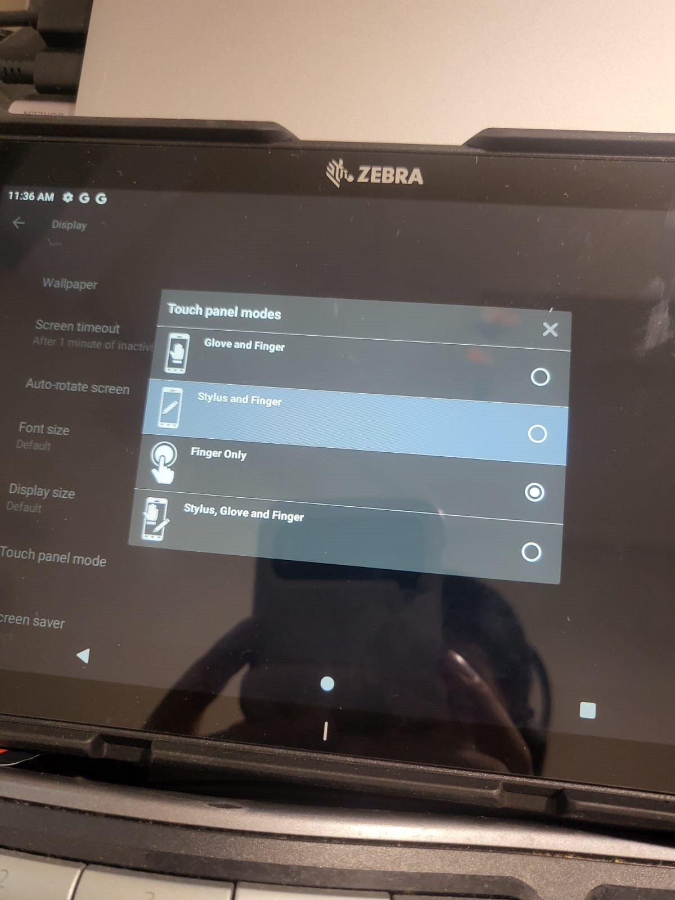

# Zebra Android端末でスタイラス、手袋を用いるための設定

現場によってはスタイラスや手袋着用の状態でタッチパネルの操作が必要となります。Zebra Android端末のタッチパネルはスタイラス、もしくは、手袋を用いた状態で操作が可能です。

ただ、デフォルトの設定ではFinger Modeとなっているため、他モードで利用する場合は設定を変更する必要があります。

 

#### 設定手順

1. A13の場合、
   設定 > ディスプレイ  > 詳細設定 > Touch Panel Mode

　※ A11の場合、少し設定方法が異なります。

 

#### 設定項目

 

| 設定項目                 | 説明                       |
| ------------------------ | -------------------------- |
| Glove and Finger         | 手袋着用、裸指             |
| Stylus and Finger        | スタイラス、裸指           |
| Finger Only              | 裸指（デフォルト設定）     |
| Stylus, Glove and Finger | スタイラス、手袋着用、裸指 |
